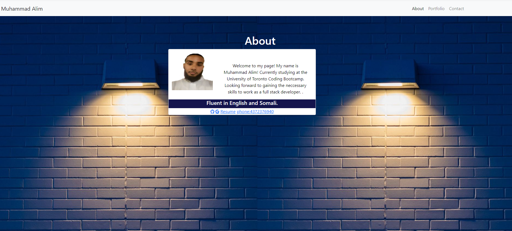

# homework2
portfolio

Responsive design ensures that web applications render well on a variety of devices and window or screen sizes. As a developer, you will likely be asked to create a mobile-first application or add responsive design to an existing application. 

## Directions

First, you will use the Bootstrap CSS Framework to create a mobile responsive portfolio. How do you deliver this? Here are some guidelines:

* Create the following files files: `index.html`, `portfolio.html` and `contact.html`.

* Using Bootstrap, develop your portfolio site with the following items:

   * A navbar

   * A responsive layout

   * Responsive images

* The Bootstrap portfolio should minimize the use of media queries.

* Screenshots are provided as a reference in the `assets` folder.

## Screenshots
 
 

## URLs

Repo Link : https://github.com/muhammadalim5/homework2.git
Deployable Link: https://muhammadalim5.github.io/homework2/

## Note:
I did not create a linked In yet, gonna do that next 